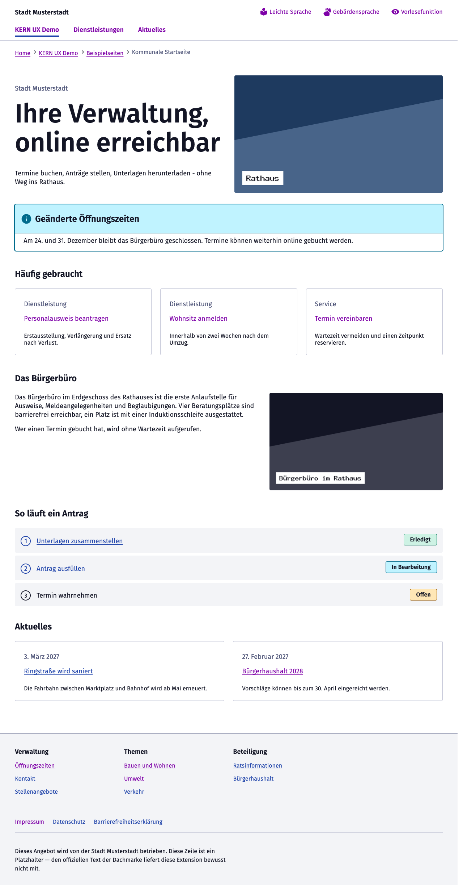
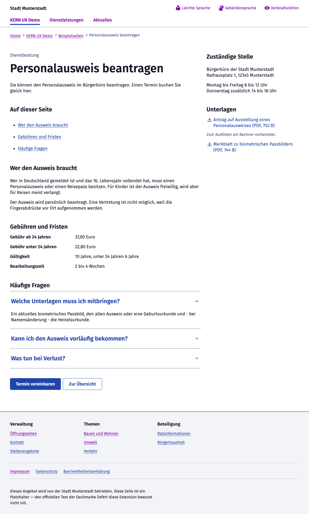
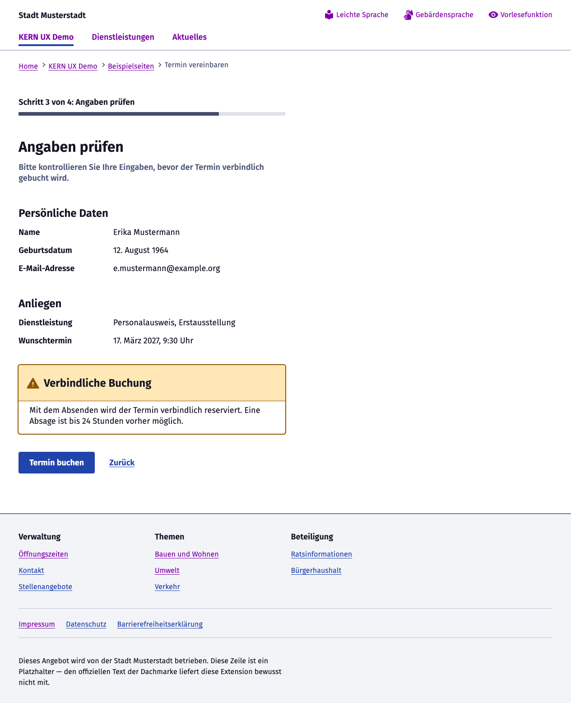
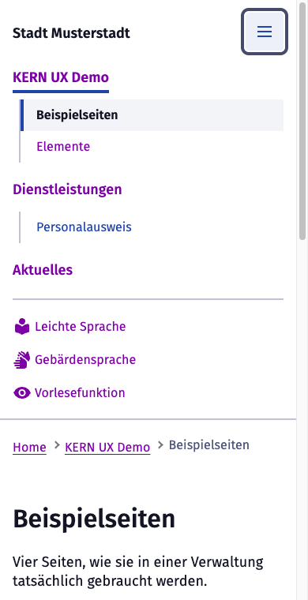
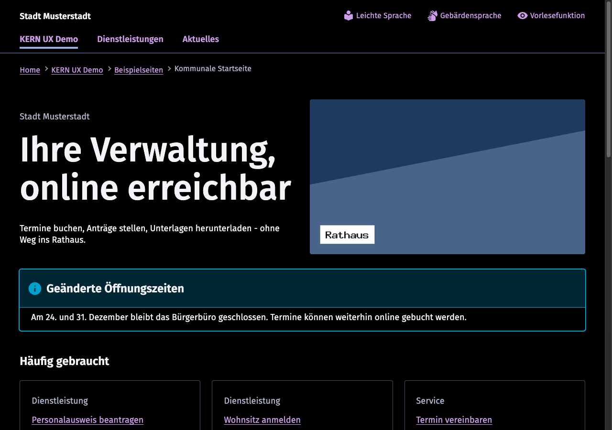
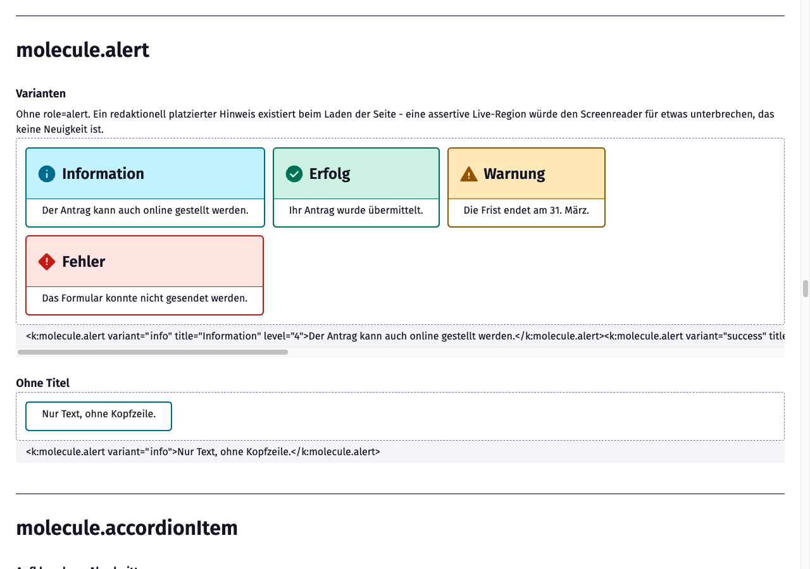
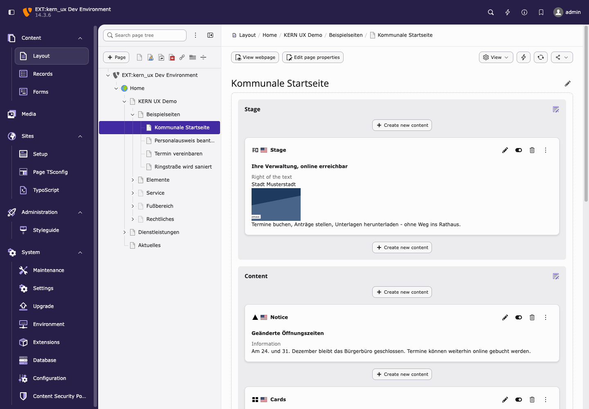

# Screenshots

Zum Anschauen, bevor man installiert. Alles hier ist der Demo-Seitenbaum, den die
Extension selbst anlegt — nichts ist für die Bilder aufgebaut oder nachgebaut worden:

```bash
vendor/bin/typo3 kern-ux:demo:install --configure-navigation
```

Die Screenshots zeigen den **Auslieferungszustand**: helles Thema, Kopfzeile der
Digitalen Dachmarke aus. Die Kopfzeile („Offizielle Website – Bundesrepublik
Deutschland") ist Angeboten von Bund, Ländern und Kommunen vorbehalten und daher
standardmäßig abgeschaltet — siehe [Digitale Dachmarke](Configuration.md#digitale-dachmarke).

---

## Kommunale Startseite

Bühne, Hinweis, Kartengitter, Text und Medien, Aufgabenübersicht, Fußbereich — sieben
Inhaltselemente auf einer Seite, alle von Redakteuren gepflegt.



## Dienstleistungsseite

Zweispaltiges Seiten-Template mit Seitenleiste: Inhaltsverzeichnis, Definitionsliste
für Gebühren und Fristen, Akkordeon für häufige Fragen, Downloads mit Format und
Dateigröße, Schaltflächen zum Abschluss.



## Antragsstrecke: Angaben prüfen

Fortschrittsanzeige, Zusammenfassungsblöcke mit Definitionslisten, ein Warnhinweis vor
der verbindlichen Buchung.



## Navigation auf dem Telefon

Ein Panel für beide Menüs: Hauptnavigation mit zweiter Ebene, darunter die Servicelinks
hinter einem Trenner. Dokumentreihenfolge und Bildschirmreihenfolge sind dieselben, die
Tastaturreihenfolge folgt also dem, was zu sehen ist.



## Dunkles Thema

Eine Zeile in den Site-Settings (`kernUx.theme`). `auto` folgt der Systemeinstellung des
Besuchers, `light` und `dark` setzen es fest. Die Farben sind KERNs eigene Tokens, nicht
eine zweite Palette von uns.



## Component-Galerie

Jede Component in ihren dokumentierten Zuständen, mit dem Quelltext, der sie erzeugt
hat — lebende Doku, Sichtprüfung und Ziel der axe-Tests in einem. Standardmäßig aus,
einzuschalten über `kernUx.styleguide.enable`.



## Backend: das sehen Redakteure

Seitenmodul mit den Content Blocks in den Spalten des Backend-Layouts. Jeder Block hat
eine eigene Vorschau, die den Inhalt zeigt statt nur den Typnamen.

> Die Bedienoberfläche und die Blocknamen stehen hier auf Englisch, weil in der
> Demo-Instanz kein deutsches Sprachpaket installiert ist. Die Extension liefert
> deutsche Labels mit: derselbe Block heißt dann *Bühne*, *Hinweis*, *Karten*.



---

Weiter zur [Installation](Installation.md) oder zurück zur [Dokumentation](README.md).
