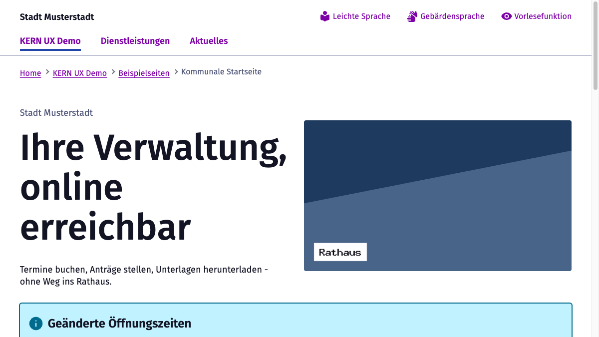

<p align="center">
  
</p>

<h1 align="center">KERN UX-Standard für TYPO3</h1>

<p align="center">
  <a href="https://packagist.org/packages/balatd/kern-ux"></a>
  <a href="https://github.com/balatD/kern_ux/actions/workflows/ci.yml"></a>
  
  
  
  
  <a href="LICENSE"></a>
</p>

Bringt den [KERN UX-Standard](https://www.kern-ux.de/) nach TYPO3 13.4 und 14.3: 40
barrierefreie **Fluid Components**, 20 **Content Blocks** für Redakteure, ein
**`ext:form`-Theme** und vier Seiten-Templates mit passenden Backend-Layouts.

Die Components sind die einzige Quelle für KERN-Markup — Content Blocks, Formulare und
Seiten rufen dieselben Components auf und bilden nur Daten darauf ab. Weil die
Barrierefreiheits-Zusagen von KERN an konkreten Klassen und ARIA-Attributen hängen,
existiert dieses Markup genau einmal und wird von Tests festgenagelt, die unter
*beiden* TYPO3-Majors laufen.

> [!WARNING]
> **Status: alpha.** In aktiver Entwicklung, noch nicht für Produktivbetrieb geeignet.
> Öffentliche Schnittstellen können sich ohne Vorwarnung ändern.

> [!NOTE]
> **Unabhängige Community-Integration.** Dieses Projekt gehört nicht zum KERN-Team und
> ist kein offizielles KERN-Kit. „KERN" und die Digitale Dachmarke für Deutschland sind
> Kennzeichen ihrer jeweiligen Inhaber; dieses Projekt beansprucht keine Rechte daran
> und wird von ihnen nicht unterstützt oder geprüft.

📸 **[Screenshots ansehen](Documentation/Screenshots.md)** — Seiten, Formularstrecke,
Mobilmenü, dunkles Thema, Component-Galerie und die Redakteurs-Sicht im Backend, alles
aus dem mitgelieferten Demo-Seitenbaum.

## Voraussetzungen

| | |
|---|---|
| TYPO3 | 13.4 LTS oder 14.3 LTS |
| PHP | 8.2 – 8.5 |
| Content Blocks | `friendsoftypo3/content-blocks` (1.x unter v13, 2.x unter v14) |
| `ext:form` | optional, nur für die Formular-Templates |

## Installation

Das Paket liegt auf [Packagist](https://packagist.org/packages/balatd/kern-ux).
Veröffentlicht ist bisher nur eine Vorabversion, deshalb braucht Composer die
Stabilitätsangabe `@alpha` — ein Projekt mit dem üblichen `minimum-stability: stable`
findet das Paket sonst nicht:

```bash
composer require balatd/kern-ux:^1.0@alpha
vendor/bin/typo3 extension:setup
vendor/bin/typo3 kern-ux:assets:install
```

Der letzte Schritt ist **erforderlich**: die KERN-Distribution wird bewusst nicht
mitgeliefert, sondern einmalig zur Installationszeit von npm geholt und per SHA-512
geprüft (siehe [THIRD-PARTY.md](THIRD-PARTY.md)). Zur Laufzeit werden keine
Fremd-Requests ausgeführt und kein CDN eingebunden. Das Zielverzeichnis ist nicht
eingecheckt, der Schritt gehört also in jedes Deployment.

Danach in der Site das Set **KERN UX-Standard** auswählen — damit stehen Templates,
Backend-Layouts und Settings bereit. Einen Demo-Seitenbaum zum Ansehen legt
`kern-ux:demo:install` an; beides samt einer Falle im TYPO3-Setup beschreibt die
[Installationsanleitung](Documentation/Installation.md).

## Dokumentation

| | |
|---|---|
| [Installation](Documentation/Installation.md) | Setup, KERN-Assets, Demo-Seitenbaum, Stolperfallen |
| [Konfiguration](Documentation/Configuration.md) | Site-Settings, Thema, Navigation, Digitale Dachmarke, RTE |
| [Components](Documentation/Components.md) | Component-Schicht, Galerie, eigene Components schreiben |
| [Content Blocks](Documentation/ContentBlocks.md) | Die 20 Blöcke, Seiten-Templates, Backend-Vorschauen |
| [Formulare](Documentation/Forms.md) | `ext:form`-Theme, Fehlerbehandlung, `KernDate` |
| [Barrierefreiheit](Documentation/Accessibility.md) | axe-Läufe, Prüfumfang, was von Hand bleibt |
| [Entwicklung](Documentation/Development.md) | DDEV-Harness für beide Majors, Tests, Sprachen |
| [Screenshots](Documentation/Screenshots.md) | Der Demo-Seitenbaum in Bildern |

## Lizenz

GPL-2.0-or-later. Zu den Lizenzen der zur Installationszeit geholten KERN-Assets siehe
[THIRD-PARTY.md](THIRD-PARTY.md).
